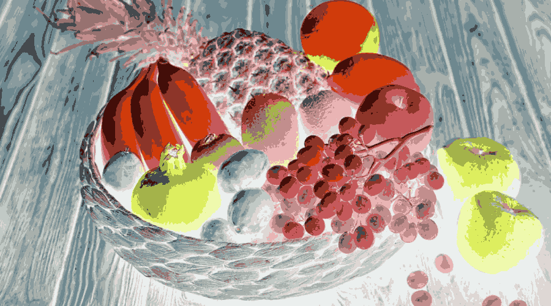

# Image Segmentation using KMeans Clustering with Coresets

This project implements an image segmentation algorithm using KMeans clustering, enhanced with coresets for improved computational efficiency. The technique leverages coresets to reduce the data size while preserving key features, allowing for scalable and efficient processing of large image datasets.

## Project Overview

The goal of this project is to segment an image into distinct regions based on color similarity using the KMeans clustering algorithm. To optimize performance, the coreset method is applied to reduce the dataset size, resulting in faster computations and reduced memory usage. The image segmentation algorithm groups pixels with similar color values into clusters, producing segmented images that represent different regions.

## Key Features

- **KMeans Clustering**: Segments the image by clustering pixels based on color similarity.
- **Coreset Optimization**: Reduces the number of data points using coresets, improving computational efficiency.
- **Efficient Image Processing**: By leveraging coresets, the algorithm can handle larger images and datasets with reduced computational resources.
- **Visualization**: Outputs segmented images both for the original and coreset-processed data.

## Installation

Ensure that you have Python installed along with the necessary libraries:

1. Clone the repository

2. Install dependencies

## Usage

### 1. Import the required libraries:
```python
import numpy as np
import cv2
from sklearn.cluster import KMeans
from scipy.spatial.distance import cdist
from PIL import Image
```

### 2. Load and prepare the image:
```python
image = cv2.imread('fruits.jpg')
image_shape = image.shape
m, n = image_shape[0], image_shape[1]
```

### 3. Implement Coreset-based Sampling:
```python
def d(x, B):
    min_dist = 1e+20
    B_close = -1
    for i in range(len(B)):
        dist = np.linalg.norm(x - B[i])
        if dist < min_dist:
            min_dist = dist
            B_close = i
    return dist, B_close

def D2(data, k):
    flattened_data = data.reshape(-1, data.shape[-1])
    centroids = []
    centroids.append(flattened_data[np.random.randint(flattened_data.shape[0])])
    for i in range(1, k):
        distances = cdist(flattened_data, np.array(centroids))
        min_distances = np.min(distances, axis=1)
        probabilities = min_distances ** 2 / np.sum(min_distances ** 2)
        new_centroid_index = np.random.choice(flattened_data.shape[0], p=probabilities)
        centroids.append(flattened_data[new_centroid_index])
    return np.array(centroids)

centroids = D2(image, k=17)
```

### 4. Perform Coreset-based Sampling:
```python
coreset, weight = Sampling(image, k=17, centers=centroids, Sample_size=100)
```

### 5. Apply KMeans Clustering:
```python
kmeans = KMeans(n_clusters=17, init='k-means++', max_iter=10).fit(coreset, sample_weight=weight)
centers = kmeans.cluster_centers_
centers = np.array(centers)
```

### 6. Segment the Image:
```python
for i in range(m):
    for j in range(n):
        d_f = d(image[i][j], centers)
        image[i][j] = centers[int(d_f[1])]
```

### 7. Save the Segmented Images:
```python
# Save the segmented original image
segmented_image = Image.fromarray((image * 255).astype(np.uint8))
segmented_image.save("Segmented_Orignal.png")

# Segment the coreset and save
for i in range(coreset.shape[0]):
    d_f = d(coreset[i], centers)
    coreset[i] = centers[int(d_f[1])]
    
coreset_image = Image.fromarray((image * 255).astype(np.uint8))
coreset_image.save("Segmented_Coreset.png")
```

## Example

Here’s a sample segmentation result using KMeans with coreset optimization:

**Input Image:**


**Segmented Image (Original):**



**Segmented Image (Coreset):**


## Performance

- **Speed**: The coreset method significantly improves processing speed by reducing the number of data points, making the algorithm faster even for large images.
- **Memory Efficiency**: By reducing the size of the dataset, the algorithm requires less memory, which is particularly beneficial for high-resolution images.


